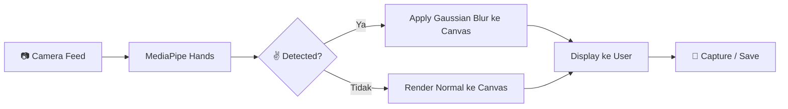

# FotoKita Blur - Web App Trend "Foto Kita Blur"

Membuat web app yang mendeteksi pose ✌️ (dua jari: telunjuk & tengah) dari kamera, lalu mengaplikasikan efek blur pada feed kamera secara real-time. App harus bisa diakses via HP teman-teman dan bisa di-deploy gratis ke Vercel.

## Tech Stack

| Teknologi | Alasan |
|-----------|--------|
| **Next.js (App Router)** | Framework React yang native support Vercel deployment |
| **MediaPipe Hands** | Library Google untuk hand landmark detection di browser (JS/WASM), ringan & akurat |
| **Canvas API** | Untuk render video feed + efek blur secara real-time |
| **Vanilla CSS** | Styling premium tanpa dependency tambahan |

## Arsitektur & Cara Kerja

### Logika Deteksi ✌️ (Peace Sign)

MediaPipe Hands mengembalikan 21 landmark per tangan. Untuk mendeteksi pose dua jari:

1. **Jari telunjuk terbuka**: `landmark[8].y < landmark[6].y` (ujung telunjuk lebih tinggi dari ruas kedua)
2. **Jari tengah terbuka**: `landmark[12].y < landmark[10].y`
3. **Jari manis tertutup**: `landmark[16].y > landmark[14].y`
4. **Jari kelingking tertutup**: `landmark[20].y > landmark[18].y`
5. **Jempol tertutup**: `landmark[4].x` mendekati `landmark[3].x` (opsional, untuk akurasi lebih)

Jika kondisi 1-4 terpenuhi → ✌️ terdeteksi → aktifkan blur.

## Fitur Utama

1. **Real-time camera feed** dengan hand detection
2. **Auto blur** saat ✌️ terdeteksi (transisi smooth)
3. **Tombol capture** untuk ambil foto (baik saat blur maupun normal)
4. **Download foto** hasil capture
5. **Switch kamera** (depan/belakang) untuk HP
6. **Countdown timer** sebelum capture (3 detik)
7. **Gallery** untuk menyimpan hasil foto sementara (session)
8. **Responsive design** - optimized untuk mobile & desktop

## Proposed Changes

### Next.js Project Setup

#### [NEW] Package & Config Files
- `package.json` - Dependencies: next, react, react-dom, @mediapipe/hands, @mediapipe/camera_utils, @mediapipe/drawing_utils
- `next.config.js` - Konfigurasi Next.js standar
- `jsconfig.json` - Path alias

---

### Core Components

#### [NEW] [page.js](file:///c:/Users/azkaw/Desktop/coding/vibe/fotoKitaBlur/src/app/page.js)
- Landing page utama dengan hero section
- Tombol "Mulai Kamera" yang mengarah ke halaman kamera
- Penjelasan cara pakai (tutorial singkat)

#### [NEW] [layout.js](file:///c:/Users/azkaw/Desktop/coding/vibe/fotoKitaBlur/src/app/layout.js)
- Root layout dengan metadata SEO
- Google Fonts (Inter / Outfit)
- Global CSS import

#### [NEW] [globals.css](file:///c:/Users/azkaw/Desktop/coding/vibe/fotoKitaBlur/src/app/globals.css)
- Design system: CSS variables, colors, typography
- Glassmorphism effects, gradients
- Animasi & transitions
- Responsive breakpoints

---

### Camera Page

#### [NEW] [camera/page.js](file:///c:/Users/azkaw/Desktop/coding/vibe/fotoKitaBlur/src/app/camera/page.js)
- Halaman utama kamera
- Mengintegrasikan semua komponen kamera

#### [NEW] [CameraView.js](file:///c:/Users/azkaw/Desktop/coding/vibe/fotoKitaBlur/src/components/CameraView.js)
- Komponen utama: video element + canvas overlay
- Inisialisasi MediaPipe Hands
- Loop deteksi tangan & render frame
- Logika blur: menggunakan `ctx.filter = 'blur(Xpx)'` pada canvas
- Transisi blur smooth (gradual increase/decrease)

#### [NEW] [HandDetector.js](file:///c:/Users/azkaw/Desktop/coding/vibe/fotoKitaBlur/src/lib/HandDetector.js)
- Utility class untuk MediaPipe Hands initialization
- Fungsi `isPeaceSign(landmarks)` - deteksi ✌️
- Konfigurasi: confidence threshold, max hands

#### [NEW] [CameraControls.js](file:///c:/Users/azkaw/Desktop/coding/vibe/fotoKitaBlur/src/components/CameraControls.js)
- Tombol capture (dengan countdown 3-2-1)
- Tombol switch kamera (depan/belakang)
- Tombol flash/torch (jika supported)
- Indikator status deteksi tangan

#### [NEW] [PhotoGallery.js](file:///c:/Users/azkaw/Desktop/coding/vibe/fotoKitaBlur/src/components/PhotoGallery.js)
- Menampilkan hasil foto yang sudah di-capture
- Tombol download per foto
- Tombol share (Web Share API)
- Swipeable gallery untuk mobile

---

### UI/UX Design Plan

**Color Palette:**
- Primary: `hsl(260, 80%, 60%)` (Purple vibrant)
- Accent: `hsl(320, 80%, 60%)` (Pink/Magenta)
- Background: `hsl(240, 20%, 8%)` (Dark navy)
- Surface: `rgba(255, 255, 255, 0.05)` (Glassmorphism)

**Design Elements:**
- Dark mode by default (lebih cocok untuk kamera app)
- Glassmorphism pada kontrol panel
- Gradient border pada frame kamera
- Animasi pulse pada indikator deteksi tangan
- Smooth blur transition (0px → 15px dalam 0.3s)
- Floating action buttons dengan backdrop blur

## Verification Plan

### Manual Verification
1. Buka di browser desktop → pastikan kamera berjalan & deteksi ✌️ bekerja
2. Buka di HP via `npm run dev` + ngrok/IP lokal → pastikan responsive & switch kamera bekerja
3. Test capture foto saat blur aktif & saat normal
4. Test download foto
5. Deploy ke Vercel → test di HP teman

### Checklist
- [ ] Kamera bisa diakses di desktop & mobile browser
- [ ] Deteksi ✌️ akurat dan responsif
- [ ] Blur effect smooth dan real-time
- [ ] Capture foto berfungsi
- [ ] Download foto berfungsi
- [ ] Switch kamera (depan/belakang) berfungsi di mobile
- [ ] UI responsive dan terlihat premium
- [ ] Deploy ke Vercel berhasil

## Open Questions

> [!IMPORTANT]
> **Level blur**: Seberapa kuat efek blur yang diinginkan? Saya akan default ke `blur(15px)` yang cukup terlihat tapi masih estetik. Bisa diatur nanti.

> [!NOTE]
> **Apakah perlu fitur rekam video?** Saat ini fokus di capture foto saja. Fitur video recording bisa ditambahkan di fase berikutnya jika dibutuhkan.

> [!NOTE]
> **Watermark/branding**: Apakah perlu menambahkan watermark "FotoKita Blur" di hasil foto?
